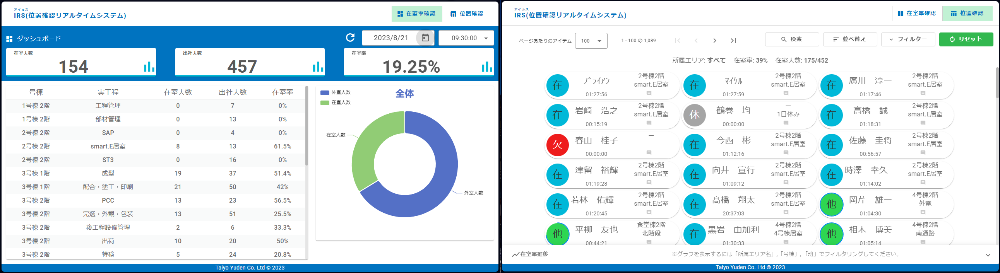

## アイルスシステム

作業者の位置確認。
緊急事態時に共通プラットフォームを活用する事での安否確認高度化(所在の把握) 
## システム所有者
ブライアンフェルナンデズ
### ソフトウェア要件
* 最新のNodeJSをダウンロードする。[NodeJS](https://nodejs.org/en/download/)
* 最新のAngularCLIをインストールする。[Angular CLI](https://angular.io/cli) 

### インストールと構成方法
* ステップ 1: ソースコードリポジトリをダウンロードする。 http://172.31.12.207:7080/git/jt0191340/rfidsystem-angular.git
* ステップ  2: ZIPファイルでダウンロードする場合は好きなファイルフォルダに抽出する。
* ステップ  3: 解凍するフォルダにCMDターミナルを設定する.
* ステップ  4: システムの依存関係ダウンロードするには**`npm install`**コマンドを実行する。
* ステップ  5: CMDターミナルで**`npm start`**コマンドを実行し、ブラウザで**http://localhost:4200/**を閲覧する。
プロジェクトは[Angular CLI](https://github.com/angular/angular-cli) version 15.1.1で生成される。

### 使用技術
* Angular CLI Version 15.1.1
* Material UI
* SASS
* Typescript/Rxjs
* GraphQL

### ビルド
* システムビルドをするようにCMDターミナルで`npm run build`コマンドを実行する。
* ビルドしたファイルは`dist/`フォルダにある。
